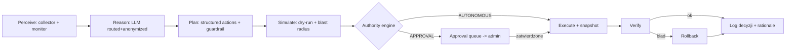

# Architektura autonomicznej administracji (graduowana autonomia)

Status: **Propozycja / ADR**
Data: 2026-06-10
Dotyczy: fundamentalnej rozbudowy AI-Admin do administrowania złożonymi
środowiskami IT z autonomią ograniczaną nadzorem administratora.

## 1. Cel

Przekształcić AI-Admin z narzędzia „prompt → plan → wykonaj” w **autonomicznego
agenta administracyjnego**, który:

- **samodzielnie** podejmuje rutynowe decyzje operacyjne (np. powiększenie
  dysku, dołożenie karty sieciowej lub dysku, instalacja aplikacji) przy pomocy
  lokalnego lub publicznego LLM,
- **pyta administratora** wyłącznie przed zmianami **destrukcyjnymi lub
  niebezpiecznymi** (human-in-the-loop),
- działa w pełni audytowalnie i z twardymi barierami bezpieczeństwa poza modelem.

## 2. Zasada przewodnia

**Graduowana autonomia, domyślnie ostrożna.** Granicy „sam vs pytaj” nie
wyznacza sztywna lista, lecz **silnik polityk** oceniający każdą akcję
wielowymiarowo. Ryzyko jest **kontekstowe**: „powiększ dysk online” to nie to
samo, co „repartycjonuj/zmniejsz”.

Poziomy autorytetu:

```
AUTONOMOUS  → wykonaj sam, zaloguj
NOTIFY      → wykonaj sam, powiadom po fakcie
APPROVAL    → wstrzymaj, zapytaj administratora
FORBIDDEN   → nigdy automatycznie
```

## 3. Co już istnieje (fundamenty)

| Komponent | Rola w autonomii |
|---|---|
| `modules/llm/command-guard.js` | ocena ryzyka pojedynczego polecenia (low/medium/high/critical) |
| `modules/llm/orchestrator.js` | wykonanie planu: dry-run, bramka zatwierdzania, stopOnError |
| `modules/llm/llm-router.js` + `anonymizer.js` + `sensitivity.js` | wybór lokalny/zewnętrzny LLM + anonimizacja danych |
| `modules/management/os-detector.js` | zdalne wykrycie/weryfikacja OS |
| `modules/management/environment-collector.js` | read-only migawka stanu (percepcja) |
| RBAC, audit, credentials, managery | wykonanie + ścieżka audytu |

Czego brakuje: model akcji z metadanymi ryzyka, silnik autorytetu, pętla
agenta, workflow zatwierdzeń, integracja z warstwą sterowania infrastrukturą,
bariery bezpieczeństwa.

## 4. Model akcji (typed actions)

Planer/LLM produkuje **akcje deklaratywne**, a metadane ryzyka uzupełnia
**moduł zdolności** (który zna semantykę operacji), nie model.

```js
// modules/actions/action-schema.js
{
  id,
  category: 'storage' | 'network' | 'compute' | 'package' | 'security' | 'service',
  intent: 'expand_filesystem',
  target: { serverId, resource: '/dev/sda1', mount: '/' },
  params: { sizeGb: 50 },

  // metadane ryzyka (z modułu zdolności):
  reversibility: 'reversible' | 'hard' | 'irreversible',
  blastRadius:   'single_service' | 'host' | 'environment',
  dataLossRisk:  'none' | 'low' | 'high',
  requiresSnapshot: true,

  preconditions: [ /* co musi być prawdą przed */ ],
  verification:  [ /* jak potwierdzić sukces */ ],
  rollback:      { /* plan wycofania */ }
}
```

To przenosi ocenę ryzyka z „zgadywania po stringu” na wiedzę domenową
(`lvextend + resize2fs` = odwracalne; `parted shrink` = nie).

## 5. Silnik autorytetu / polityk

```
modules/policy/authority-engine.js
```

Łączy: ryzyko guardraila × metadane akcji × kontekst (prod/dev) × polityka admina
→ decyzja.

```js
evaluate(action, context, policy) → {
  authority: 'AUTONOMOUS' | 'NOTIFY' | 'APPROVAL' | 'FORBIDDEN',
  reasons: [...],
  requiresSnapshot: bool
}
```

Reguły domyślne (konserwatywne, nadpisywalne przez admina):

- `dataLossRisk: high` lub `reversibility: irreversible` → **APPROVAL**
- `blastRadius: environment` → **APPROVAL**
- `environment: prod` podnosi próg o jeden poziom
- `command-guard: critical` → **FORBIDDEN**; `high` → min. **APPROVAL**
- pozostałe (expand FS, hot-add disk/NIC, install z zaufanego repo) → **AUTONOMOUS**

Polityka deklaratywna per środowisko/kategoria/okno czasowe (np. „w dev wszystko
auto”, „w prod każdy restart usługi → approval”).

## 6. Pętla autonomiczna

```
modules/agent/agent-loop.js
```



LLM dostarcza rozumowanie i propozycję; autorytet i bariery są
deterministyczne (poza modelem).

## 7. Workflow zatwierdzania (human-in-the-loop)

```
modules/approvals/approval-repo.js  + tabela approvals
```

- Kolejka „pending approvals” z pełnym kontekstem: **co**, **dlaczego**
  (uzasadnienie LLM), **diff/plan**, **blast radius**, **plan rollbacku**,
  **dry-run output**.
- Powiadomienia (e-mail/webhook/desktop), wygasanie prośby, podpisany rekord
  zatwierdzenia (kto/kiedy).
- Dopiero zatwierdzenie zwalnia orchestrator do wykonania kroku.

## 8. Moduły zdolności i providerzy infrastruktury

„Dołóż kartę sieciową / dysk” wykracza poza SSH — wymaga warstwy sterowania.

```
modules/capabilities/  storage/ network/ compute/ packages/ security/
modules/providers/     hypervisor (vSphere/Proxmox), cloud (AWS/Azure), bare-os (ssh/winrm)
```

Każda zdolność implementuje interfejs akcji (preconditions/execute/verify/
rollback + metadane ryzyka), cross-OS (Linux/Windows). Hot-add dysku idzie przez
providera hypervisora, a `os-detector` + `environment-collector` weryfikują
efekt w gościu.

## 9. Stan pożądany i dryf

```
modules/desired-state/  (deklaratywny spec) + drift-detector
```

Agent porównuje migawkę z pożądanym stanem; dryf w zakresie autonomii remediuje
sam, poza zakresem → APPROVAL. Zamienia jednorazowe zadania w ciągłe utrzymanie.

## 10. Bariery bezpieczeństwa (twarde, poza LLM)

- **Snapshot/backup** przed akcjami `requiresSnapshot` (hypervisor/LVM/kopia konfiguracji).
- **Okna zmian** i tryb konserwacji; **rate-limit** akcji.
- **Circuit breaker** — po N nieudanych akcjach autonomia się wyłącza i woła admina.
- **Canary / etapowość** dla zmian środowiskowych.
- **Kill switch** — globalny stop autonomii.
- **Self-preservation guard** — brak automatycznej akcji odcinającej własny
  dostęp (zmiana głównego NIC/firewalla zarządzającego) bez APPROVAL.

## 11. Mapa przykładów → decyzja

| Akcja | Klasyfikacja | Kto decyduje |
|---|---|---|
| Powiększenie wolumenu/FS online (`lvextend`+`resize2fs`) | reversible, dataLoss=none | **AUTONOMOUS** (+snapshot) |
| Hot-add nowego dysku + FS + mount | reversible, dataLoss=none | **AUTONOMOUS** |
| Dodanie dodatkowej karty sieciowej | reversible, blast=host | **AUTONOMOUS** |
| Instalacja aplikacji z zaufanego repo | reversible | **AUTONOMOUS** |
| Repartycjonowanie/shrink, zmiana tablicy partycji | irreversible, dataLoss=high | **APPROVAL** |
| Zmiana adresacji głównego NIC / trasy / firewalla dostępu | blast=environment, self-lockout | **APPROVAL** |
| Usunięcie danych/usługi, drop DB, decommission, reboot prod | irreversible/blast | **APPROVAL** |
| `rm -rf /`, `curl \| sh`, format dysku | critical | **FORBIDDEN** |

## 12. Roadmapa (fazami, każda testowalna)

1. **Action schema + Authority engine** — rdzeń decyzji auto/approval (keystone).
2. **Approval workflow + repo + powiadomienia** — human-in-the-loop.
3. **Agent loop** — perceive→reason→plan→gate→execute→verify→rollback.
4. **Capability: storage** (expand/add disk) end-to-end + bariery.
5. **Providerzy** (hypervisor/cloud) dla realnego „dołóż dysk/NIC”.
6. **Desired-state + drift** — ciągłe utrzymanie.

## 13. Decyzje projektowe (ADR)

- **Autorytet i bariery są deterministyczne, poza LLM.** Model proponuje;
  silnik polityk i guardrail decydują. Nigdy odwrotnie.
- **Domyślnie odmowa/zatwierdzenie.** Autonomię rozszerza admin w miarę
  budowania zaufania (progresywna autonomia per środowisko/kategoria).
- **Ryzyko liczone z metadanych akcji**, nie z dopasowania stringów —
  guardrail poleceń pozostaje ostatnią linią obrony.
- **Każda decyzja audytowalna i odtwarzalna**, z zapisanym uzasadnieniem.

## 14. Addendum: wnioski z niezależnej recenzji (Fable 5)

Recenzja architektoniczna ujawniła luki, których część już naprawiono, a część
zmienia kolejność roadmapy.

### Zrealizowane (poprawność wykonania przed nowymi funkcjami)

- **Naprawiony TOCTOU zatwierdzania.** Plan jest pinowany deterministycznym
  hashem (`plan-schema.computePlanHash`). Przepływ: `buildPlan` (podgląd + hash)
  → `executePlan(planId, { planHash, approvals })`. Wykonanie odmawia, gdy plan
  zmienił się od zatwierdzenia (`PLAN_CHANGED`). **Plan zatwierdzony == plan
  wykonany.**
- **Zgoda per-krok** zamiast blankietowej: `approvals` to zbiór id kroków;
  tylko zatwierdzone kroki `high` się wykonują (IPC: zatwierdza wyłącznie admin).
- **Skonsolidowane wykonanie w Orchestratorze** — usunięto dublującą ścieżkę
  `_executeTasksInternal`/`_executeSingleTask`; status pochodzi z orchestratora
  (naprawiony błąd `'executed'` przy samych błędach); usunięto footgun
  `allowBlocked`.
- **Rozstrzyganie kroków do konkretnych poleceń przy budowie planu**
  (`_resolveStepCommand`) — podgląd, hash i wykonanie są identyczne (dotyczy też
  instalacji pakietów i operacji na usługach, z escapowaniem/walidacją).
- **Guard uzgodniony z polityką i domknięty dla Windows.** `reboot/shutdown` i
  `Stop-Computer/Restart-Computer` → `high` (APPROVAL, nie FORBIDDEN). Dodano
  wzorce PowerShell (`Format-Volume`, `Clear-Disk`, `Remove-Item -Recurse`,
  `Disable-NetAdapter`, `Set-NetFirewallProfile -Enabled False`) oraz luki Unix
  (`find -delete`, `shred`, `base64|sh`, `bash -c "$(curl…)"`).
- **Blokada nieodtworzonego placeholdera anonimizacji** w poleceniu
  (`[[TYP_n]]` → critical) — defense-in-depth przeciw wyciekowi tokenów do shella.
- **Wydzielony control plane (`AppService`) niezależny od Electrona.** Konstrukcja
  managerów/repozytoriów/LLM oraz cykl życia (start/stop, migracje, journal,
  recovery) są w `modules/service/app-service.js`. Electron używa go jako rdzenia
  (UI = klient), a `service/headless.js` uruchamia ten sam backend jako
  zawsze-włączoną usługę (`npm run start:service`) z `/health` i czystym
  zamknięciem. To pierwszy krok rozdziału UI ↔ usługa.
- **Trwały journal wykonania (`modules/journal/execution-journal.js`).** Stany
  kroków (pending/executing/done/error/skipped/needs_verification/verify_failed/
  compensated), idempotencja (krok 'done' nie jest ponawiany przy wznowieniu),
  wykrycie kroków przerwanych awarią (zostają 'executing') i **recovery bez
  ślepego ponowienia** (przerwane → needs_verification). Wpięty w
  `LLMManager.executePlan`; `AppService.start` wykonuje recovery.
- **Uwierzytelniony transport poleceń (`AppService.dispatch` + headless
  `POST /rpc`).** Wspólna ścieżka dla UI i usługi: rozwiązanie sesji + RBAC +
  rejestr handlerów rdzeniowych (auth/serwery/llm/env), token w nagłówku
  `x-session-token`. Bootstrap administratora przy pustej bazie kont.
- **Weryfikacja po wykonaniu + saga/kompensacje (orchestrator).** Krok może mieć
  `verify` (postcondition; kod ≠ 0 → `verify_failed`) i `compensation` (rollback).
  Przy niepowodzeniu w trybie saga już wykonane kroki są wycofywane w odwrotnej
  kolejności (status planu `rolled_back`). `verify`/`compensation` wchodzą do
  hasha planu (są więc objęte zatwierdzeniem).
- **Read-back przerwanych kroków po restarcie.** Journal trzyma `verify`/
  `compensation` per krok. `AppService.start` po `recover()` woła
  `LLMManager.verifyInterruptedSteps`: dla kroków `needs_verification` uruchamia
  ich `verify` (read-only) i ustala 'done' bez ślepego ponawiania operacji;
  nierozstrzygnięte zostają do ręcznej decyzji.
- **Obrona przed zatrutą percepcją (`modules/llm/perception-guard.js`).** Dane ze
  zdalnych, niezaufanych hostów są traktowane jako nieufne: `detectInjection`
  wykrywa próby przejęcia instrukcji (PL/EN, role-markery, tokeny specjalne),
  `sanitizeText`/`sanitizeValue` neutralizują (usuwają sekwencje sterujące i
  frazy-instrukcje, ograniczają długość), a `wrapUntrusted` opakowuje dane w
  prompt jako jawne DANE (nie polecenia). Wpięte w `task-generator` (host/nazwy
  aplikacji) oraz `environment-collector` (flaguje `perceptionWarnings` do
  eskalacji w pętli autonomicznej).
- **Wykrywanie self-lockout (guardrail).** Polecenia mogące odciąć własną ścieżkę
  zarządzania (zatrzymanie SSH/WinRM, wyłączenie głównego NIC, firewall blokujący
  port zarządzania, usunięcie domyślnej trasy) są klasyfikowane jako `high`
  (APPROVAL) z flagą `selfLockout` — nigdy autonomicznie. (MVP oparty na wzorcach;
  pełny, tranzytywny model „ścieżki zarządzania" pozostaje rozwinięciem.)
- **Aprobata pinuje hash prekondycji stanu.** `buildPlan` może uchwycić odcisk
  stanu serwera (`preconditionHash`), a `executePlan` odrzuca wykonanie
  (`PLAN_STATE_CHANGED`), gdy stan zmienił się od zatwierdzenia — aprobata wygasa
  nie tylko po czasie, ale i po zmianie stanu. Provider odcisku jest wstrzykiwalny
  (domyślnie lekki fingerprint OS/hostname; mechanizm domyślnie wyłączony).

### Do zrobienia (zrewidowana kolejność — poprawność wykonania > authority engine)

1. **Pełna migracja UI na `AppService.dispatch`** i uczynienie journala jedynym
   źródłem prawdy o stanie (dziś magazyn planów jest in-memory; transport pokrywa
   rdzeniowe kanały, Electron wciąż ma własne handlery dla pozostałych).
2. **`verify` jako obowiązkowy element kontraktu capability** (timeouty,
   wykrywanie flappingu, postconditions dla zmian wielohostowych) — dziś `verify`
   jest opcjonalne i wypełniane ręcznie/przez typed actions.
3. **Typed actions jako jedyna ścieżka w trybie autonomicznym** — zakaz
   `type:'command'`; `target` wiązany z inwentarzem migawki (po UUID/serialu),
   prekondycje ewaluowane na świeżej migawce w momencie wykonania.
4. **Reklasyfikacja `sudo`** po przejściu na typed actions — dziś `sudo`=high
   powoduje approval fatigue dla rutynowych instalacji.
5. **Pełny, tranzytywny model self-lockout** (jumphost/DNS/trasy) ponad obecny
   MVP oparty na wzorcach.
6. **Nowy poziom autonomii: ODROCZONE Z PRAWEM WETA** (most między NOTIFY a
   APPROVAL) — „wykonam za T, chyba że zawetujesz".

### Decyzje technologiczne (zrewidowane)

- **Electron tylko jako UI; control plane jako usługa Node.** SQLite wystarcza na
  start (WAL + journal akcji); przy wielu operatorach/HA → Postgres + lease'y.
  Audyt wynieść poza lokalną bazę (append-only).
- **Nie pisać warstwy wykonawczej od zera.** Rozważyć syntezę przez LLM
  **parametrów do zweryfikowanych, idempotentnych akcji/playbooków** (model
  zbliżony do Ansible check-mode = prawdziwy dry-run) zamiast surowych stringów
  powłoki; providerzy infrastruktury (vSphere/cloud) przez natywne API, nie SSH.
