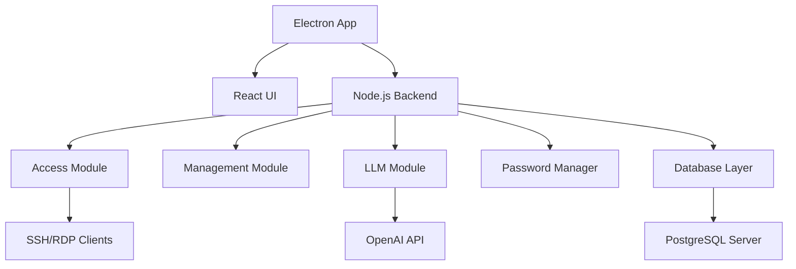

# Architektura Aplikacji Desktopowej do Zarządzania Serwerami

## 1. Analiza Wymagań

### Funkcjonalne:
- **Dostęp do serwerów**: RDP dla Windows, SSH dla Linux
- **Zarządzanie**: Usługi, użytkownicy, udziały sieciowe
- **Integracja LLM**: Generowanie promptów dla zmian (np. instalacja oprogramowania)
- **Manager haseł**: Bezpieczne przechowywanie i zarządzanie hasłami
- **Centralna baza danych**: Zaszyfrowana SQL na zewnętrznym serwerze, wieloużytkownikowa

### Niefunkcjonalne:
- Bezpieczeństwo: Szyfrowanie danych, uwierzytelnianie
- Skalowalność: Obsługa wielu serwerów i użytkowników
- Łatwość utrzymania: Modularna architektura, dokumentacja

## 2. Wybór Technologii

- **Framework Desktop**: Electron (cross-platform, JavaScript/Node.js)
- **Backend**: Node.js (integracja z Electron, asynchroniczne operacje)
- **UI**: React (komponentowy, wydajny dla desktop)
- **SSH**: node-ssh lub ssh2
- **RDP**: rdp-client lub integracja z systemowymi narzędziami (np. xfreerdp na Linux)
- **LLM**: OpenAI API (GPT dla generowania zadań)
- **Baza danych**: PostgreSQL (relacyjna, pgcrypto dla szyfrowania)
- **Szyfrowanie**: crypto (Node.js), AES-256
- **Komunikacja**: HTTPS/TLS, WebSockets dla real-time

## 3. Struktura Komponentów

### Moduły:
- **Access Module**: Obsługa RDP/SSH połączeń
- **Management Module**: API dla zarządzania usługami/użytkownikami/udziałami
- **LLM Module**: Integracja z OpenAI, generowanie promptów
- **Password Manager**: Szyfrowane przechowywanie haseł
- **Database Layer**: ORM (Sequelize), synchronizacja danych
- **UI Components**: React komponenty dla dashboard, listy serwerów, itp.
- **Security Module**: Uwierzytelnianie, szyfrowanie

## 4. Architektura Danych

### Schemat Bazy:
- `users`: id, username, email, encrypted_password, role
- `servers`: id, name, ip, type (windows/linux), credentials_id
- `credentials`: id, server_id, username, encrypted_password
- `tasks`: id, server_id, description, status, generated_by_llm
- `logs`: id, user_id, action, timestamp

### Szyfrowanie:
- Wrażliwe kolumny (passwords) zaszyfrowane AES-256
- Klucze zarządzane przez KMS lub lokalnie (dla desktop)

### Synchronizacja:
- Conflict resolution: Last-write-wins lub manual
- Offline support: Lokalna cache z sync przy połączeniu

## 5. Bezpieczeństwo

- **Uwierzytelnianie**: JWT tokens, refresh tokens
- **Szyfrowanie**: TLS 1.3 dla komunikacji, AES dla danych
- **Autoryzacja**: Role-based access (admin, user)
- **Audyt**: Logowanie wszystkich działań

## 6. Skalowalność i Utrzymanie

- **Modularność**: Każdy moduł niezależny, łatwe testowanie
- **Skalowalność**: Horizontal scaling bazy, caching
- **Utrzymanie**: Dokumentacja, CI/CD, automated tests

## 7. Diagramy Architektury

## 8. Uzasadnienie Wyborów

- **Electron**: Cross-platform, łatwa integracja z Node.js
- **React**: Szybki development, reusable components
- **PostgreSQL**: Silne szyfrowanie, ACID compliance
- **OpenAI**: Zaawansowane LLM dla generowania zadań
- **Modularna architektura**: Łatwość rozszerzania i utrzymania

## 9. Podsumowanie

Projekt obejmuje bezpieczną, skalowalną aplikację desktopową z integracją LLM. Następne kroki: Implementacja prototypu w Code mode.